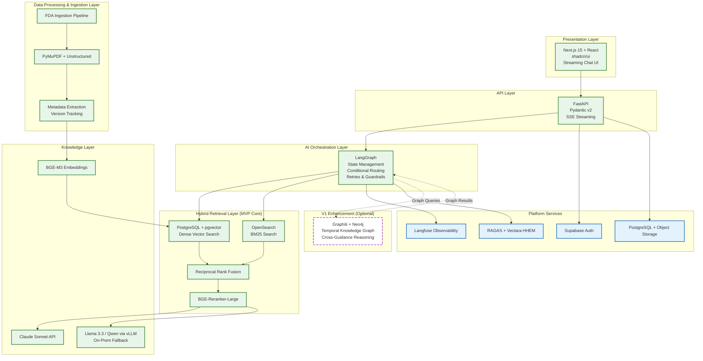
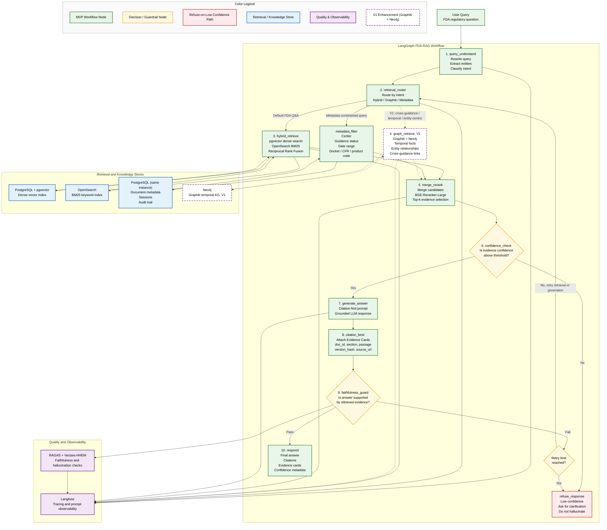

# Architeture diagram

## Layered Architecture diagram

---
# Figure 2: LangGraph Node/Edge Design for the FDA Regulatory RAG Workflow

**Description:** LangGraph node/edge design for the FDA regulatory RAG workflow, including a retrieval router (hybrid + Graphiti + metadata), reranking, a faithfulness guardrail, and a refuse-on-low-confidence path. Solid green boxes represent MVP components; dashed purple components represent the V1 Graphiti + Neo4j knowledge graph enhancement, introduced after the hybrid RAG core is stable.

---

## Diagram

---

## Legend Reference

- **Green (solid):** MVP workflow nodes — the core citation-first hybrid RAG flow.
- **Amber (diamond):** Decision and guardrail nodes — confidence check, faithfulness guard, and retry logic.
- **Red:** Refuse-on-low-confidence path — the safety exit that prevents hallucinated answers.
- **Blue:** Retrieval and knowledge stores — PostgreSQL + pgvector and OpenSearch.
- **Purple (solid):** Quality and observability — Langfuse tracing plus RAGAS and Vectara HHEM evaluation.
- **Purple (dashed):** V1 enhancement — Graphiti and Neo4j temporal knowledge graph, added after the MVP is stable.

---

## The Ten Nodes

| # | Node | Responsibility | Key Libraries / Components |
|---|------|----------------|----------------------------|
| 1 | `query_understand` | Rewrite the question, classify intent, extract entities (drug, device, CFR, center, guidance type). | LlamaIndex, Pydantic |
| 2 | `retrieval_router` | Decide retrieval path. Hybrid by default; graph only for cross-guidance, temporal, or entity-centric queries (V1). | LangGraph conditional edges |
| 3 | `hybrid_retrieve` | Dense vector search, BM25 keyword search, metadata filters, and reciprocal rank fusion. | PostgreSQL + pgvector, OpenSearch, LlamaIndex |
| 4 | `graph_retrieve` | Query Graphiti for related entities, temporal facts, timelines, and cross-document relationships (V1 only). | Graphiti Core, Neo4j |
| 5 | `merge_rerank` | Merge candidates and rerank top results using a cross-encoder. | Sentence Transformers, BGE-Reranker |
| 6 | `confidence_check` | Validate retrieval strength; route to refusal if below threshold. | Pydantic, custom scoring |
| 7 | `generate_answer` | Generate a citation-first answer using grounded context only. | Anthropic SDK / OpenAI-compatible client |
| 8 | `citation_bind` | Attach each citation to doc ID, section, passage, version hash, and source URL. | Custom evidence-card logic |
| 9 | `faithfulness_guard` | Check whether the answer is supported by retrieved evidence; retry if needed. | RAGAS, Vectara HHEM |
| 10 | `respond` | Return final payload: answer, citations, confidence, and evidence cards. | FastAPI, SSE |
