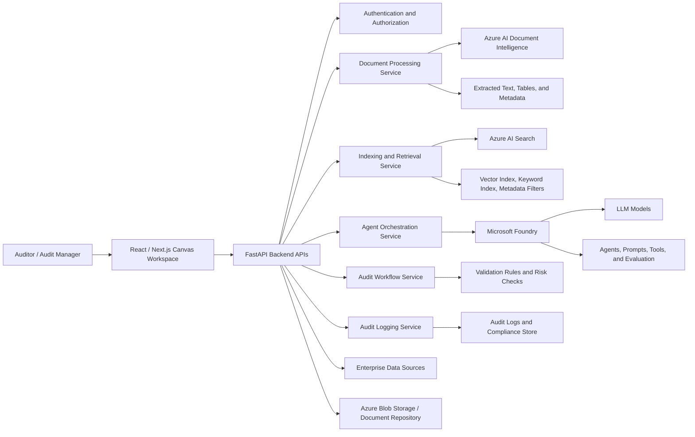
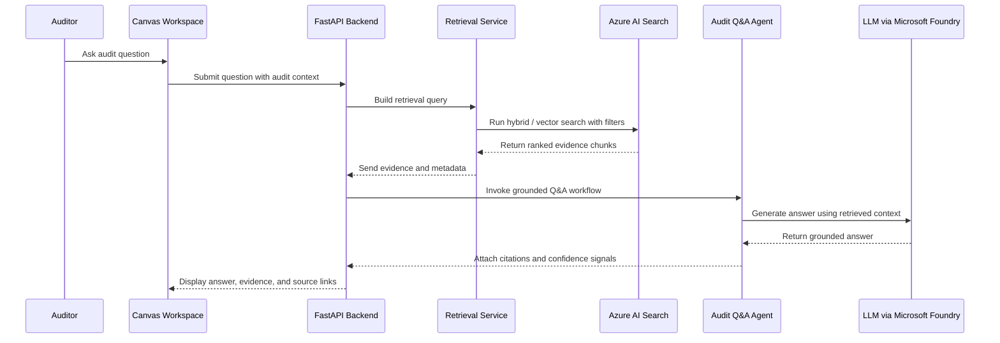
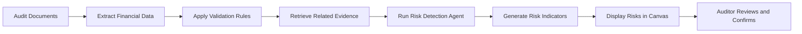
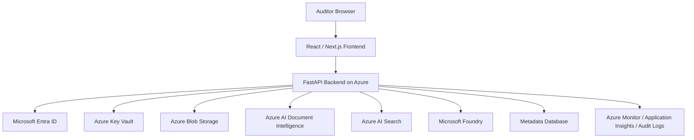

# Solution Design Document

## Project Name

**Audit Workspace**

---

## 1. Executive Summary

Audit Workspace is an Azure-deployed, AI-powered unified workspace designed for financial auditors. The platform centralizes audit artifacts, automates evidence extraction, enables natural language querying across audit documents, and supports auditors with intelligent agentic workflows.

The solution combines **React / Next.js**, **Python FastAPI**, **Azure AI Document Intelligence**, **Azure AI Search**, **Microsoft Foundry**, and LLM-powered agents to improve audit efficiency, evidence traceability, and financial risk identification.

The platform is not designed to replace auditor judgment. Instead, it assists auditors by retrieving relevant evidence, summarizing documents, extracting key audit data, highlighting risks, and providing explainable AI responses grounded in source documents.

---

## 2. Business Context

Financial auditors typically work across multiple documents, spreadsheets, supporting evidence files, financial statements, and enterprise systems. This creates challenges such as:

- Audit artifacts are distributed across multiple repositories and formats.
- Manual document review consumes significant auditor time.
- Evidence extraction from financial documents is repetitive and error-prone.
- Auditors require source traceability for every finding or conclusion.
- Financial risk indicators may be hidden across multiple documents.
- Traditional search is often insufficient for semantic audit questions.

Audit Workspace addresses these challenges by providing a single intelligent canvas where auditors can review documents, inspect extracted evidence, ask natural language questions, and work with AI-generated insights in a governed environment.

---

## 3. Solution Objectives

The key objectives of the solution are:

1. Provide a unified canvas workspace for financial auditors.
2. Centralize audit documents, extracted evidence, AI summaries, and risk insights.
3. Automate document parsing and evidence extraction using Azure AI Document Intelligence.
4. Enable semantic and hybrid retrieval using Azure AI Search.
5. Support grounded audit Q&A using Retrieval-Augmented Generation.
6. Use LLM-powered agents for audit assistance, validation, summarization, and risk highlighting.
7. Ensure enterprise-grade security, governance, compliance, and audit traceability.
8. Improve audit turnaround time and reduce manual review effort.

---

## 4. Solution Scope

### 4.1 In Scope

- Unified audit canvas workspace.
- Audit document upload and discovery.
- Document parsing and text extraction.
- Table, key-value, and structured data extraction.
- Metadata enrichment and document classification.
- Chunking, embedding generation, and indexing.
- Azure AI Search based vector and hybrid search.
- Natural language Q&A over audit artifacts.
- AI-generated document summaries.
- Evidence extraction and source traceability.
- Financial risk highlighting.
- AI-assisted validation workflows.
- Secure backend APIs.
- Role-based access control.
- Audit logging and monitoring.

### 4.2 Out of Scope

- Replacement of ERP, finance, or accounting systems.
- Fully autonomous audit sign-off.
- Final audit judgment automation.
- Regulatory filing submission.
- Training foundation models from scratch.
- Replacing human review and approval.

---

## 5. User Roles

| Role | Responsibility |
|---|---|
| Auditor | Reviews audit documents, extracts evidence, asks questions, and validates findings. |
| Audit Manager | Reviews audit progress, risk summaries, and key findings. |
| Compliance Reviewer | Verifies traceability, audit quality, and governance adherence. |
| System Administrator | Manages users, roles, configuration, and access policies. |
| AI Platform Administrator | Manages prompts, models, agents, retrieval configuration, and monitoring. |

---

## 6. High-Level Solution Overview

Audit Workspace is deployed on Azure and follows a modular architecture:

- **Frontend:** React / Next.js canvas workspace.
- **Backend:** Python FastAPI services.
- **Document Intelligence:** Azure AI Document Intelligence for OCR, layout, table, text, and structured extraction.
- **Search and Retrieval:** Azure AI Search for vector search, keyword search, semantic ranking, and metadata filtering.
- **AI Orchestration:** Microsoft Foundry for LLM-powered agents, model orchestration, evaluation, and governance.
- **Data Layer:** Azure storage, metadata database, vector index, and audit log store.
- **Security:** Microsoft Entra ID, RBAC, encryption, private networking where required, and audit logging.

---

## 7. Architecture Diagram

---

## 8. Architecture Layers

### 8.1 User Experience Layer

The user experience layer is implemented using **React / Next.js**. It provides a canvas-style workspace where auditors can interact with audit artifacts, AI insights, extracted evidence, and document summaries.

Key capabilities:

- Open and review audit documents.
- View extracted evidence and metadata.
- Ask natural language audit questions.
- Display AI-generated summaries.
- Highlight risks and anomalies.
- Pin important evidence on the canvas.
- Navigate from AI response to source document.

---

### 8.2 API and Backend Layer

The backend is implemented using **Python FastAPI**. It acts as the secure API and orchestration layer between the frontend, document processing pipeline, retrieval layer, AI agents, and enterprise systems.

Key responsibilities:

- User request handling.
- Document upload and validation.
- Metadata management.
- Retrieval pipeline execution.
- Agent workflow orchestration.
- AI response grounding.
- Audit trace generation.
- Security and access enforcement.
- Logging and observability.

---

### 8.3 Document Intelligence Layer

The document intelligence layer uses **Azure AI Document Intelligence** to extract content from financial audit documents. Azure AI Document Intelligence supports extraction of text, key-value pairs, tables, and structured data from documents using OCR and deep learning models.

Supported document examples:

- Financial statements.
- Trial balance reports.
- Bank statements.
- Ledger extracts.
- Invoices.
- Receipts.
- Audit evidence documents.
- PDF, scanned documents, Word files, and Excel-based evidence exports.

Processing steps:

1. Validate uploaded document.
2. Store original document securely.
3. Extract text, layout, tables, and key-value information.
4. Normalize extracted output.
5. Generate document metadata.
6. Split content into meaningful chunks.
7. Generate embeddings.
8. Index content into Azure AI Search.

---

### 8.4 Search and Retrieval Layer

The retrieval layer uses **Azure AI Search** as the enterprise retrieval engine. Azure AI Search supports vector search, keyword search, search index configuration, semantic retrieval patterns, and ranking strategies that are suitable for RAG-based applications.

Key capabilities:

- Vector search for semantic similarity.
- Keyword search for exact financial terms and identifiers.
- Hybrid search to combine semantic and lexical matching.
- Metadata filtering by engagement, client, document type, year, audit area, and source.
- Semantic reranking to improve result quality.
- Source-aware retrieval for traceability.

This layer is responsible for retrieving the most relevant evidence before calling the LLM or agent workflow.

---

### 8.5 AI and Agentic Workflow Layer

The AI layer uses **Microsoft Foundry** and an agent framework to support LLM-powered audit workflows. Microsoft Foundry supports building, grounding, evaluating, and governing AI apps and agents at enterprise scale.

Example agents:

| Agent | Responsibility |
|---|---|
| Audit Q&A Agent | Answers auditor questions using retrieved evidence. |
| Evidence Extraction Agent | Extracts audit-relevant facts, amounts, dates, entities, and references. |
| Risk Detection Agent | Highlights potential financial risks or inconsistencies. |
| Validation Agent | Compares extracted evidence against expected values or audit checks. |
| Summary Agent | Generates document summaries and audit notes. |
| Workflow Assistant Agent | Guides auditors through audit review steps and required actions. |

---

## 9. Key Functional Capabilities

### 9.1 Unified Audit Canvas

The canvas provides a single interface where auditors can review documents, AI summaries, evidence snippets, risk indicators, and chat responses.

Capabilities:

- Multi-document review.
- Side-by-side document and insight view.
- Evidence pinning.
- Source citation navigation.
- AI chat panel.
- Risk and validation panels.

---

### 9.2 Document Upload and Ingestion

Auditors can upload audit documents or access documents from configured enterprise repositories.

Capabilities:

- File validation.
- Document storage.
- Duplicate detection.
- Metadata capture.
- OCR and layout extraction.
- Table extraction.
- Chunking and indexing.

---

### 9.3 Natural Language Audit Q&A

Auditors can ask questions such as:

- What are the key risks in this financial statement?
- Show evidence for revenue recognition.
- Summarize audit findings for this client.
- Are there inconsistencies between invoices and ledger entries?
- Which documents support this audit conclusion?

The system retrieves relevant evidence from Azure AI Search and generates a grounded response using the LLM.

---

### 9.4 Evidence Extraction

The platform extracts audit-relevant evidence from documents.

Examples:

- Revenue figures.
- Expense categories.
- Vendor names.
- Invoice numbers.
- Transaction dates.
- Bank balances.
- Ledger references.
- Reporting periods.
- Notes to accounts.

---

### 9.5 Risk Highlighting

The platform helps auditors identify risk indicators from audit artifacts.

Examples:

- Missing supporting evidence.
- Unusual transaction values.
- Duplicate invoices.
- Inconsistent totals across documents.
- Revenue recognition concerns.
- Manual journal entry risks.
- Variance between financial statements and supporting evidence.

---

### 9.6 AI-Assisted Validation

The validation workflow compares extracted evidence against rules, expected values, or related documents.

Examples:

- Validate invoice total against line-item totals.
- Compare ledger values with financial statement values.
- Check whether required evidence is available.
- Identify missing documentation for audit assertions.
- Flag mismatches between extracted data and audit rules.

---

## 10. Detailed Data Flows

### 10.1 Document Ingestion Flow

```mermaid
flowchart LR
    A[Upload Audit Document] --> B[Validate File Type and Metadata]
    B --> C[Store Original File in Azure Storage]
    C --> D[Analyze with Azure AI Document Intelligence]
    D --> E[Extract Text, Tables, Layout, and Key Values]
    E --> F[Normalize and Enrich Metadata]
    F --> G[Chunk Content]
    G --> H[Generate Embeddings]
    H --> I[Index in Azure AI Search]
    I --> J[Available for Search, RAG, and Agents]
```

---

### 10.2 Audit Q&A Flow

---

### 10.3 Risk Detection Flow

---

## 11. Azure Services Mapping

| Capability | Azure Service / Technology |
|---|---|
| Frontend hosting | Azure App Service or Azure Static Web Apps |
| Backend APIs | Python FastAPI hosted on Azure App Service, Azure Container Apps, or AKS |
| Document storage | Azure Blob Storage |
| Document extraction | Azure AI Document Intelligence |
| Vector and hybrid retrieval | Azure AI Search |
| LLM and agent orchestration | Microsoft Foundry |
| Identity and access | Microsoft Entra ID |
| Secrets management | Azure Key Vault |
| Monitoring | Azure Monitor and Application Insights |
| Audit logging | Azure Log Analytics, database audit tables, or storage-based logs |
| Metadata storage | Azure SQL Database, Cosmos DB, or another approved enterprise store |

---

## 12. Security Design

Security is a core part of the solution because audit documents contain sensitive financial data.

Key controls:

- Microsoft Entra ID based authentication.
- Role-based access control.
- Engagement-level authorization.
- Secure document storage with encryption.
- Secure API communication over HTTPS.
- Managed identities for Azure service access.
- Secrets stored in Azure Key Vault.
- Access control at document and metadata level.
- Audit trail for user actions and AI interactions.
- Logging of retrieval context, prompts, responses, and source references where permitted.
- Data retention policies aligned with enterprise compliance requirements.

---

## 13. Governance and Compliance

The platform is designed to support audit governance and responsible use of AI.

Governance capabilities:

- Traceability between AI response and source document.
- Human review before audit conclusions are finalized.
- Prompt and response audit logging.
- Versioned prompts and agent configurations.
- Controlled access to audit engagements.
- Model usage monitoring.
- Evaluation of retrieval quality and AI response quality.
- Compliance-aligned retention and archival policies.

---

## 14. Responsible AI Considerations

| Principle | Design Consideration |
|---|---|
| Transparency | AI responses should include supporting source references. |
| Accountability | Final audit judgment remains with the auditor. |
| Reliability | RAG and retrieval grounding reduce unsupported responses. |
| Safety | Sensitive financial data is protected through enterprise controls. |
| Human Oversight | Auditors review extracted evidence, risks, and AI findings. |
| Traceability | System logs user actions, retrieved evidence, and generated outputs. |

---

## 15. Non-Functional Requirements

| Category | Requirement |
|---|---|
| Security | Protect audit data using identity, RBAC, encryption, and secure networking. |
| Performance | Provide responsive document search and AI-assisted question answering. |
| Scalability | Support multiple audit engagements and increasing document volumes. |
| Availability | Deploy backend and critical services using resilient Azure patterns. |
| Maintainability | Keep services modular and independently deployable. |
| Extensibility | Allow new agents, document types, workflows, and validation rules to be added. |
| Auditability | Maintain traceability for user actions, AI responses, and source evidence. |
| Accuracy | Use retrieval grounding, metadata filtering, reranking, and human review. |

---

## 16. Key Design Decisions

| Area | Decision | Rationale |
|---|---|---|
| Cloud platform | Azure | Aligns with enterprise-grade identity, security, AI, and data services. |
| Frontend | React / Next.js | Supports modern interactive canvas-based user experience. |
| Backend | Python FastAPI | Lightweight, performant, and well suited for AI service orchestration. |
| Document extraction | Azure AI Document Intelligence | Supports OCR, text, table, key-value, and structured extraction. |
| Search | Azure AI Search | Supports vector search, keyword search, and RAG retrieval patterns. |
| AI platform | Microsoft Foundry | Provides enterprise platform capabilities for AI apps and agents. |
| Architecture style | Modular service-based design | Improves maintainability, scalability, and extensibility. |
| AI response pattern | RAG with citations | Grounds responses in retrieved audit evidence. |
| Governance | Audit logging and human oversight | Required for trust, compliance, and audit defensibility. |

---

## 17. Risks and Mitigations

| Risk | Impact | Mitigation |
|---|---|---|
| AI hallucination | Incorrect or unsupported audit response | Use RAG, citations, retrieval filters, prompt controls, and human review. |
| Poor OCR or extraction quality | Missing or inaccurate evidence | Use Azure AI Document Intelligence, confidence scores, validation, and manual review. |
| Weak retrieval accuracy | Irrelevant answers | Use hybrid search, metadata filtering, chunk optimization, and semantic reranking. |
| Sensitive data exposure | Compliance and security issue | Use RBAC, encryption, managed identity, Key Vault, and secure logging. |
| Over-reliance on AI | Audit quality risk | Keep auditor approval mandatory. |
| Incomplete document metadata | Reduced retrieval precision | Enforce metadata schema and ingestion validation. |
| Large document volume | Performance degradation | Use scalable indexing, batching, async processing, and monitoring. |

---

## 18. Deployment View

---

## 19. Observability and Monitoring

The solution should include observability across backend services, retrieval pipelines, AI calls, and document processing jobs.

Recommended monitoring areas:

- API latency and failure rates.
- Document ingestion status.
- Extraction errors.
- Indexing failures.
- Search latency.
- Retrieval quality metrics.
- LLM response latency.
- Token usage and cost.
- Agent execution traces.
- User activity audit logs.
- Security events.

---

## 20. Impact

The Audit Workspace improves audit execution by creating a unified intelligent workspace powered by agentic workflows.

Expected impact:

- Faster audit turnaround.
- Reduced manual document review effort.
- Improved ability to locate relevant evidence.
- Better visibility into financial risks.
- Stronger traceability from findings to source documents.
- Improved consistency in audit review.
- Increased auditor productivity through natural language assistance.

---

## 21. Role and Contribution

As Solution Architect / GenAI Architect, the contribution included:

- Architected the GenAI solution using AI agents, RAG pipelines, Azure AI Search, and secure backend services.
- Designed the interactive canvas workspace for auditors to view documents, evidence, insights, and summaries.
- Integrated LLM-based assistants for audit Q&A, evidence extraction, financial risk highlighting, and summarization.
- Designed backend workflows for document parsing, indexing, semantic retrieval, and AI-driven validation.
- Used Azure AI Document Intelligence for document extraction and Azure AI Search for vector and hybrid retrieval.
- Integrated Microsoft Foundry for LLM and agent orchestration.
- Ensured the architecture aligned with enterprise security, governance, compliance, and audit standards.

---

## 22. Interview-Ready Project Summary

I designed an AI-powered Audit Workspace for financial auditors. The goal was to centralize audit artifacts, automate evidence extraction, and allow auditors to interact with audit documents using natural language.

The solution was deployed on Azure. I used React and Next.js for the interactive canvas workspace, Python FastAPI for backend services, Azure AI Document Intelligence for extracting text, tables, and structured data from documents, Azure AI Search for semantic and hybrid retrieval, and Microsoft Foundry for LLM-powered agents and orchestration.

The system follows a RAG-based architecture. Audit documents are ingested, parsed, chunked, embedded, and indexed into Azure AI Search. When an auditor asks a question, the retrieval layer fetches relevant evidence and passes it to an LLM-powered agent to generate a grounded response with source traceability.

A major design focus was governance. Since audit workflows require explainability and accountability, the solution ensured that AI-generated responses are supported by source evidence, user actions are logged, and final audit judgment remains with the auditor.

The platform improved audit efficiency by reducing manual document review, accelerating evidence discovery, and supporting auditors with intelligent risk and validation workflows.

---

## 23. Source References

- Azure AI Search supports search index configuration, vector search approaches, and retrieval strategies for RAG solutions: https://learn.microsoft.com/en-us/azure/architecture/ai-ml/guide/rag/rag-information-retrieval
- Azure AI Document Intelligence extracts text, key-value pairs, tables, and structured data from documents: https://learn.microsoft.com/en-us/training/modules/extract-data-with-document-intelligence/
- Microsoft Foundry is described as an enterprise AI platform to build, ground, and govern AI apps and agents at scale: http://ai.azure.com/
