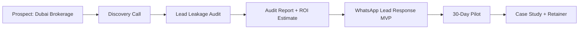
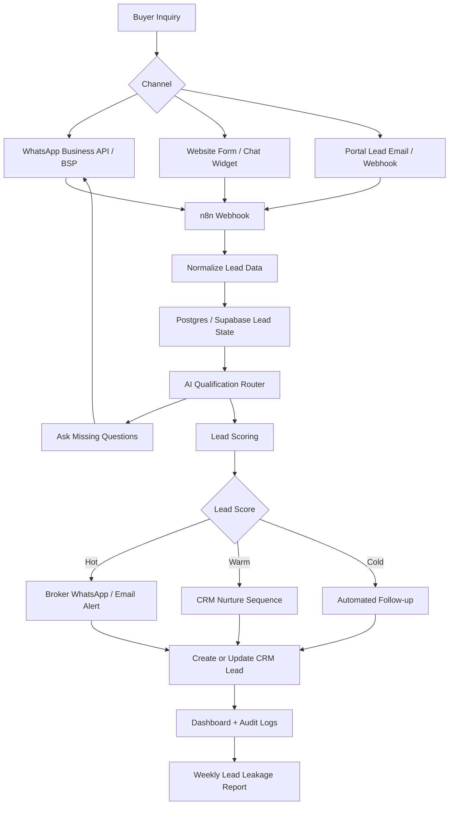

# Lead Leakage Audit → WhatsApp MVP Blueprint
## Tools, Tech Stack, Architecture & 14-Day Implementation Plan

**Prepared for:** Faizan Akhtar Shaikh  
**Target niche:** Dubai real estate brokerages  
**Primary offer:** Lead Leakage Audit → WhatsApp Lead Response & Viewing Booking MVP  
**Recommended build approach:** Low-code-first, pro-code-ready  
**Version:** V1.0

---

## 1. Executive Recommendation

For the first 1–3 paying clients, use a **low-code-first, pro-code-ready** approach.

Do **not** build a full SaaS product upfront. Your immediate goal is to sell a paid **Lead Leakage Audit**, convert it into a **WhatsApp Lead Response MVP**, and prove that Dubai brokerages will pay for this outcome.

### Recommended approach

> Use **n8n + WhatsApp Business API/BSP + CRM integration + LLM API + lightweight database** for the MVP. Add pro-code components only where low-code becomes limiting.

### Why this approach fits your situation

- You need revenue quickly.
- You need proof before building a platform.
- Dubai buyers need a working demo and measurable ROI, not architecture theory.
- n8n gives speed while still allowing API integration, custom logic, and self-hosting.
- Your solution architect background becomes valuable when you harden and productize after early traction.

---

## 2. No-Code vs Low-Code vs Pro-Code Decision

### Final decision

| Approach | Use now? | Recommendation |
|---|---:|---|
| Pure no-code chatbot builder | ❌ No | Too limited and commoditized. Weak differentiation. |
| Low-code automation | ✅ Yes | Best for audit, demo, MVP, CRM sync, routing, notifications. |
| Pro-code backend | ⚠️ Later / selective | Use only for webhooks, conversation state, RAG, reusable modules, multi-client scale. |
| Full SaaS product | ❌ Not now | Build only after 2–3 paying clients and repeated workflow pattern. |

### Practical rule

Use **low-code** when you need to move fast and validate.

Use **pro-code** when you need reliability, reuse, complexity control, or multi-client scale.

---

## 3. Offer Flow



---

## 4. Lead Leakage Audit Blueprint

### 4.1 Audit objective

The audit identifies where a brokerage is losing leads before a broker can respond.

Common leakage points:

- Leads stuck in email inboxes.
- Leads going to personal WhatsApp numbers.
- No central CRM record.
- No after-hours response.
- No hot/warm/cold scoring.
- No automated viewing booking.
- No follow-up sequence.
- No management visibility into broker response time.

### 4.2 Audit duration and pricing

| Item | Recommendation |
|---|---|
| Duration | 3–5 working days |
| Price | AED 2,500–5,000 |
| Format | Fixed-scope paid diagnostic |
| Output | Lead Leakage Report + MVP implementation plan |

### 4.3 Audit inputs to request from client

Ask the brokerage for:

- website URL,
- WhatsApp number used for inquiries,
- lead source list,
- CRM name,
- sample lead records if available,
- current response process,
- sales team structure,
- inquiry channels,
- monthly lead volume estimate,
- ad spend estimate if available.

### 4.4 Audit activities

#### Activity 1 — Lead source mapping

Document every source:

- Property Finder,
- Bayut,
- Dubizzle,
- website form,
- WhatsApp,
- Instagram / Meta Ads,
- Google Ads,
- referrals,
- walk-ins,
- email.

#### Activity 2 — Mystery inquiry test

Run a controlled test:

1. Submit a website form.
2. Send WhatsApp inquiry.
3. Ask about a property.
4. Record response time.
5. Track whether the inquiry enters CRM.
6. Track whether follow-up happens.

#### Activity 3 — CRM/process review

Check:

- Is every lead recorded?
- Is source captured?
- Is broker assignment tracked?
- Is response SLA visible?
- Are duplicate leads merged?
- Are hot leads prioritized?
- Is WhatsApp history attached to the lead?

#### Activity 4 — Leakage scoring

Score each area from 1 to 5:

| Area | Score meaning |
|---|---|
| Lead capture | Are all leads captured centrally? |
| Response speed | Is first response fast and consistent? |
| Qualification | Is buyer intent captured? |
| CRM hygiene | Is CRM reliable and updated? |
| Broker handoff | Is accountability clear? |
| Follow-up | Are warm/cold leads nurtured? |
| Reporting | Can management see leakage? |

### 4.5 Audit deliverable structure

Deliver a short report with these sections:

1. Executive summary
2. Current lead journey
3. Lead leakage points
4. Response-time observations
5. CRM/process gaps
6. Automation opportunities
7. Estimated revenue leakage
8. Recommended MVP workflow
9. Implementation timeline
10. Pricing proposal for MVP

---

## 5. WhatsApp MVP Blueprint

### 5.1 MVP outcome

The MVP should achieve this:

> Buyer sends a WhatsApp or website inquiry → AI responds instantly → buyer is qualified → lead is scored → broker is notified → lead is created/updated in CRM → viewing is booked or follow-up triggered.

### 5.2 MVP scope

#### In scope

- WhatsApp inbound lead capture
- Website form/widget capture
- AI qualification flow
- Lead scoring
- CRM create/update
- Broker notification
- Human handoff
- Basic analytics dashboard
- Error logs
- Weekly report

#### Out of scope for first MVP

- full SaaS platform,
- multi-tenant admin portal,
- advanced RAG over all listings,
- voice AI,
- mobile app,
- complex multi-agent system,
- custom CRM,
- multi-language support beyond English unless paid add-on.

---

## 6. Recommended MVP Architecture



---

## 7. Tool and Tech Stack

## 7.1 V0 Demo Stack

Use this to create a demo before a paid client.

| Layer | Tool | Purpose |
|---|---|---|
| WhatsApp demo | WATI / 360dialog sandbox / mock WhatsApp UI | Demonstrate flow |
| Automation | n8n Cloud | Fast workflow creation |
| CRM | HubSpot free / Zoho free | Lead creation demo |
| Database | Google Sheets / Airtable | Lightweight state for demo |
| LLM | GPT-4o mini / Claude Haiku | Qualification and summaries |
| Demo video | Loom | Sales asset |
| Reporting | Google Sheets | Simple audit dashboard |

### V0 goal

Create a 90-second demo video showing:

1. Buyer sends inquiry.
2. AI replies instantly.
3. AI asks qualification questions.
4. Lead is scored.
5. Broker receives notification.
6. CRM lead is created.

---

## 7.2 MVP Stack for First Client

| Layer | Recommended tools | Notes |
|---|---|---|
| WhatsApp | 360dialog / WATI / Qmize / Interakt | Use BSP for faster setup and shared inbox if needed |
| Orchestration | n8n Cloud or n8n self-hosted | Use Cloud for speed, self-hosted if client needs stronger control |
| CRM | HubSpot / Zoho / Bitrix24 | Start with one CRM integration per client |
| Database | Supabase Postgres | Store lead state and message logs |
| AI model | GPT-4o mini / Claude Haiku / Gemini Flash | Keep cost low; use structured prompts |
| Dashboard | Retool / Metabase / CRM dashboard | Basic operating dashboard |
| Notifications | WhatsApp / Email / Slack | Broker handoff |
| Project docs | Notion / Google Docs / Markdown | Delivery documentation |

---

## 7.3 V1 Scalable Stack After 2–3 Clients

| Layer | Recommended tools | Purpose |
|---|---|---|
| WhatsApp | 360dialog or direct Meta Cloud API | More control and predictable integration |
| Backend | FastAPI or Node.js/NestJS | Custom webhook and reusable services |
| Orchestration | n8n self-hosted | Client workflow automation |
| DB | Postgres | Source of truth |
| Queue | Redis + Celery / BullMQ | Reliable async processing |
| Vector DB | pgvector or Qdrant | RAG over listings/docs |
| LLM gateway | LiteLLM | Model routing and fallback |
| Observability | Langfuse + Sentry | Prompt tracing and error tracking |
| Dashboard | Retool / Next.js | Client dashboard |
| Deployment | Docker + Azure Container Apps / DigitalOcean / Hetzner | Repeatable deployment |
| Secrets | Azure Key Vault / Doppler | Secure credentials |
| Version control | GitHub | Reusable codebase |

---

## 8. Build vs Buy Guidance

### Use BSP built-in features when:

- client wants shared inbox,
- no dedicated technical team,
- you need fast onboarding,
- workflow is simple,
- no deep customization required.

### Use n8n when:

- you need CRM sync,
- routing logic,
- lead scoring,
- custom notifications,
- dashboard data,
- multi-step workflow,
- low-code flexibility.

### Use pro-code when:

- conversation state becomes complex,
- client needs custom API integrations,
- you are building reusable modules,
- you need RAG,
- compliance requires stronger control,
- you need observability and testing.

---

## 9. WhatsApp Conversation Script

### Opening message

```text
Hi, thanks for your inquiry. I can help you find the right property.

To match you quickly, may I ask a few questions?
```

### Qualification questions

```text
1. Are you looking to buy or rent?
2. What is your budget range?
3. Which area do you prefer? For example: Dubai Marina, Downtown, JVC, Business Bay.
4. What property type are you looking for? Apartment, villa, townhouse, or off-plan?
5. How many bedrooms do you need?
6. What is your timeline? This week, this month, 1–3 months, or later?
7. Would you like to schedule a viewing?
```

### Hot lead response

```text
Great, I have enough details to connect you with the right property advisor.

A broker will contact you shortly with suitable options and viewing slots.
```

### Broker handoff message

```text
🔥 HOT LEAD: Dubai Marina 2BR Buyer

Name: Ahmed
Budget: AED 2.2M
Area: Dubai Marina / JBR
Property type: 2BR apartment
Timeline: This month
Purpose: Investment
Viewing: Weekend preferred
Source: Website WhatsApp

Recommended action: Call within 5 minutes.
```

### Warm lead nurture message

```text
Thanks. I’ll share a few suitable options based on your preference.

If you confirm your budget and preferred move-in or purchase timeline, I can narrow the list further.
```

---

## 10. Lead Scoring Rules

### Lead fields

```text
name
phone
source
buy_or_rent
budget
area_preference
property_type
bedrooms
timeline
purpose
financing_type
viewing_preference
language
lead_score
assigned_broker
crm_id
conversation_status
handoff_status
created_at
updated_at
```

### Hot lead

A lead is hot when:

- budget is provided,
- area is provided,
- property type is provided,
- timeline is within 30 days,
- buyer asks for viewing or callback,
- valid WhatsApp number exists.

### Warm lead

A lead is warm when:

- some key details are missing,
- timeline is 1–3 months,
- buyer is exploring options,
- budget or area is unclear.

### Cold lead

A lead is cold when:

- no clear budget,
- no timeline,
- vague inquiry,
- no intent to view,
- unresponsive after follow-up.

### Scoring formula example

```text
budget_provided = 20 points
area_provided = 15 points
property_type_provided = 15 points
timeline_under_30_days = 25 points
viewing_requested = 25 points

score >= 75 = Hot
score 40–74 = Warm
score < 40 = Cold
```

---

## 11. Database Schema

### Table: leads

```sql
create table leads (
    id uuid primary key default gen_random_uuid(),
    phone text not null,
    name text,
    source text,
    buy_or_rent text,
    budget text,
    area_preference text,
    property_type text,
    bedrooms text,
    timeline text,
    purpose text,
    financing_type text,
    viewing_preference text,
    language text default 'en',
    lead_score int default 0,
    lead_status text default 'new',
    assigned_broker text,
    crm_id text,
    conversation_status text default 'open',
    handoff_status text default 'not_handed_off',
    created_at timestamptz default now(),
    updated_at timestamptz default now()
);
```

### Table: messages

```sql
create table messages (
    id uuid primary key default gen_random_uuid(),
    lead_id uuid references leads(id),
    direction text not null,
    channel text default 'whatsapp',
    message_text text,
    raw_payload jsonb,
    created_at timestamptz default now()
);
```

### Table: audit_events

```sql
create table audit_events (
    id uuid primary key default gen_random_uuid(),
    lead_id uuid references leads(id),
    event_type text,
    event_data jsonb,
    created_at timestamptz default now()
);
```

### Table: brokers

```sql
create table brokers (
    id uuid primary key default gen_random_uuid(),
    name text not null,
    phone text,
    email text,
    areas text[],
    property_types text[],
    active boolean default true,
    created_at timestamptz default now()
);
```

---

## 12. CRM Field Mapping

| MVP field | HubSpot / Zoho / Bitrix24 equivalent |
|---|---|
| name | Contact name |
| phone | Mobile / WhatsApp |
| source | Lead source |
| budget | Budget custom field |
| area_preference | Area / location preference |
| property_type | Property type |
| bedrooms | Bedrooms |
| timeline | Buying timeline |
| lead_score | Lead score |
| lead_status | Lifecycle stage / deal stage |
| assigned_broker | Owner / responsible user |
| conversation_summary | Notes |
| viewing_preference | Task / appointment field |

---

## 13. n8n Workflow List

### Workflow 1 — Inbound WhatsApp Message

Trigger:

- WhatsApp webhook from BSP

Steps:

1. Receive message.
2. Validate payload.
3. Find or create lead by phone number.
4. Store message.
5. Pass message to qualification router.
6. Send response.

### Workflow 2 — Qualification Router

Steps:

1. Load lead state.
2. Check missing fields.
3. Ask next question.
4. Extract answer using LLM or rules.
5. Update lead state.
6. Calculate lead score.

### Workflow 3 — Hot Lead Handoff

Trigger:

- lead_score >= 75

Steps:

1. Select broker based on area/property type.
2. Send broker notification.
3. Create/update CRM lead.
4. Create CRM task.
5. Mark handoff status.

### Workflow 4 — Warm Lead Nurture

Trigger:

- lead_score between 40 and 74

Steps:

1. Send follow-up prompt.
2. Schedule next message.
3. Update CRM status.

### Workflow 5 — Cold Lead Follow-up

Trigger:

- lead_score < 40 or no reply after 24 hours

Steps:

1. Send gentle follow-up.
2. Mark as low priority.
3. Notify only if engagement improves.

### Workflow 6 — Error Handling

Steps:

1. Catch failed workflow.
2. Log error.
3. Notify admin.
4. Retry if safe.
5. Escalate to human if needed.

### Workflow 7 — Weekly Report

Steps:

1. Count total leads.
2. Count hot/warm/cold leads.
3. Count broker handoffs.
4. Count unanswered leads.
5. Generate weekly summary.
6. Email/report to client.

---

## 14. LLM Prompt Template

### System prompt

```text
You are an AI lead qualification assistant for a Dubai real estate brokerage.
Your job is to qualify property inquiries, collect missing information, and route hot leads to a human broker.

Rules:
- Be concise and professional.
- Ask only one or two questions at a time.
- Do not invent property availability.
- Do not provide legal, financial, or investment guarantees.
- If the buyer is ready for viewing or has a timeline under 30 days, mark as high priority.
- If unsure, ask a clarification question.
- Always keep the conversation suitable for WhatsApp.
```

### Extraction prompt

```text
Extract the following fields from the user's message.
Return valid JSON only.

Fields:
- buy_or_rent
- budget
- area_preference
- property_type
- bedrooms
- timeline
- purpose
- viewing_preference
- language

User message:
{{message}}

Known lead state:
{{lead_state}}
```

### Broker summary prompt

```text
Create a short broker handoff summary for this real estate lead.
Include budget, area, property type, bedrooms, timeline, and recommended next action.
Keep it under 120 words.

Lead state:
{{lead_state}}
```

---

## 15. Security and Compliance Checklist

### MVP checklist

- Get explicit WhatsApp opt-in where proactive messages are used.
- Keep opt-out handling.
- Do not store unnecessary personal data.
- Do not share lead data with unapproved tools.
- Store tokens and API keys in secure credentials manager.
- Restrict CRM/API access by role.
- Log handoff and automation events.
- Have human takeover option.
- Do not make investment guarantees.
- Do not provide legal/tax advice about property purchase.

### Healthcare secondary vertical caution

For clinics, keep automation limited to administrative workflows:

- booking,
- reminders,
- rescheduling,
- intake routing,
- review requests.

Avoid:

- diagnosis,
- treatment advice,
- medication advice,
- clinical decision support,
- medical-record interpretation.

---

## 16. 14-Day MVP Sprint Plan

### Days 1–2 — Discovery and audit

Deliver:

- lead source map,
- current response journey,
- CRM/process review,
- MVP workflow confirmation.

### Days 3–4 — WhatsApp setup

Deliver:

- BSP selected,
- number configured,
- webhook enabled,
- test inbound/outbound messages.

### Days 5–6 — n8n core workflows

Deliver:

- inbound webhook workflow,
- lead creation workflow,
- message logging,
- CRM create/update.

### Days 7–8 — AI qualification

Deliver:

- qualification flow,
- extraction prompt,
- missing-field logic,
- lead scoring rules.

### Days 9–10 — Broker handoff

Deliver:

- broker assignment,
- WhatsApp/email alerts,
- CRM task creation,
- human takeover path.

### Days 11–12 — Dashboard and QA

Deliver:

- lead dashboard,
- error workflow,
- test cases,
- edge-case handling.

### Days 13–14 — Go-live and training

Deliver:

- live pilot,
- broker training,
- fallback SOP,
- weekly report template,
- 30-day optimization plan.

---

## 17. Testing Checklist

### Functional tests

- New lead creates CRM contact.
- Existing lead updates same record.
- Missing budget triggers budget question.
- Missing area triggers area question.
- Hot lead triggers broker alert.
- Warm lead enters nurture sequence.
- Cold lead does not spam broker.
- Human takeover stops AI response.
- Error workflow alerts admin.

### Conversation tests

Test messages like:

```text
I want a 2BR in Dubai Marina around AED 2M.
```

```text
Do you have villas in Arabian Ranches?
```

```text
Looking for off-plan investment in Business Bay.
```

```text
Can I see this property tomorrow?
```

```text
Just browsing.
```

---

## 18. KPI Dashboard

Track these metrics:

| KPI | Why it matters |
|---|---|
| Total leads received | Volume baseline |
| Response within 60 seconds | Speed-to-lead metric |
| Hot leads identified | Sales priority |
| Viewings requested | Conversion intent |
| Broker handoffs | Operational output |
| CRM records created | Data hygiene |
| Unanswered leads | Leakage indicator |
| Human takeover count | Bot limitation / complexity |
| Failed workflows | Reliability |
| Conversion to viewing | Business outcome |

---

## 19. ROI Calculation Template

Use this simple formula in the audit:

```text
Monthly leads = X
Estimated missed or slow-response leads = Y%
Average qualified lead-to-viewing rate = A%
Average viewing-to-deal rate = B%
Average commission per deal = C
Potential recovered revenue = X * Y% * A% * B% * C
```

Example placeholder:

```text
Monthly leads = 300
Slow/missed leads = 30% = 90
Qualified to viewing = 20% = 18
Viewing to deal = 5% = 0.9 deals
Average commission = AED 50,000
Potential recovered commission = AED 45,000/month
```

Do not present this as guaranteed revenue. Present it as an estimated leakage opportunity.

---

## 20. Delivery Assets to Create

Create only these assets before outreach:

1. 90-second demo video
2. One-page offer PDF
3. Sample Lead Leakage Audit report
4. ROI calculator Google Sheet
5. LinkedIn outreach sequence
6. Discovery call script
7. MVP architecture diagram

Avoid building the full product before client validation.

---

## 21. Recommended Folder Structure

```text
lead-leakage-whatsapp-mvp/
├── docs/
│   ├── offer-one-pager.md
│   ├── audit-template.md
│   ├── discovery-questions.md
│   ├── implementation-plan.md
│   └── fallback-sop.md
├── n8n-workflows/
│   ├── inbound-whatsapp.json
│   ├── qualification-router.json
│   ├── crm-sync.json
│   ├── broker-handoff.json
│   └── weekly-report.json
├── prompts/
│   ├── system-prompt.md
│   ├── extraction-prompt.md
│   └── broker-summary-prompt.md
├── database/
│   ├── schema.sql
│   └── seed-demo-data.sql
├── assets/
│   ├── demo-script.md
│   └── roi-calculator.xlsx
└── README.md
```

---

## 22. Build Roadmap

### V0 — Demo

Goal:

- show the flow,
- win discovery calls,
- sell audit.

Stack:

- n8n Cloud,
- mock WhatsApp or BSP sandbox,
- HubSpot free,
- Google Sheets,
- LLM API.

### MVP — First paid client

Goal:

- production pilot,
- lead capture,
- broker handoff,
- CRM sync,
- weekly report.

Stack:

- WhatsApp BSP,
- n8n,
- Supabase Postgres,
- client CRM,
- GPT-4o mini / Claude Haiku.

### V1 — Repeatable delivery

Goal:

- reusable workflows,
- better logging,
- optional RAG,
- multiple CRM adapters.

Stack:

- n8n self-hosted,
- FastAPI/Node webhook service,
- Postgres,
- LiteLLM,
- Langfuse,
- pgvector/Qdrant.

### V2 — Productized platform

Goal:

- multi-client dashboard,
- white-label agency delivery,
- subscription retainers,
- vertical expansion.

Stack:

- Next.js dashboard,
- FastAPI/NestJS backend,
- Postgres,
- queue system,
- vector DB,
- tenant isolation,
- billing.

---

## 23. Final Recommendation

Start with this stack:

```text
n8n Cloud or self-hosted
+ WhatsApp BSP such as 360dialog / WATI / Qmize
+ HubSpot / Zoho / Bitrix24 CRM
+ Supabase Postgres
+ GPT-4o mini or Claude Haiku
+ Retool / Metabase / CRM dashboard
```

Then, after 2–3 paying clients, build reusable pro-code services for:

- webhook handling,
- conversation state,
- CRM adapters,
- lead scoring,
- RAG,
- observability,
- multi-client deployment.

The strategic priority is not to build more software. The priority is to prove that Dubai brokerages will pay to stop losing leads.

---

## 24. Immediate Next Steps

1. Create the sample Lead Leakage Audit report.
2. Build the WhatsApp demo flow.
3. Record 90-second demo video.
4. Create the ROI calculator.
5. Build a 100-brokerage prospect list.
6. Message warm GCC contacts for feedback and intros.
7. Start selling the audit before building the full MVP.
