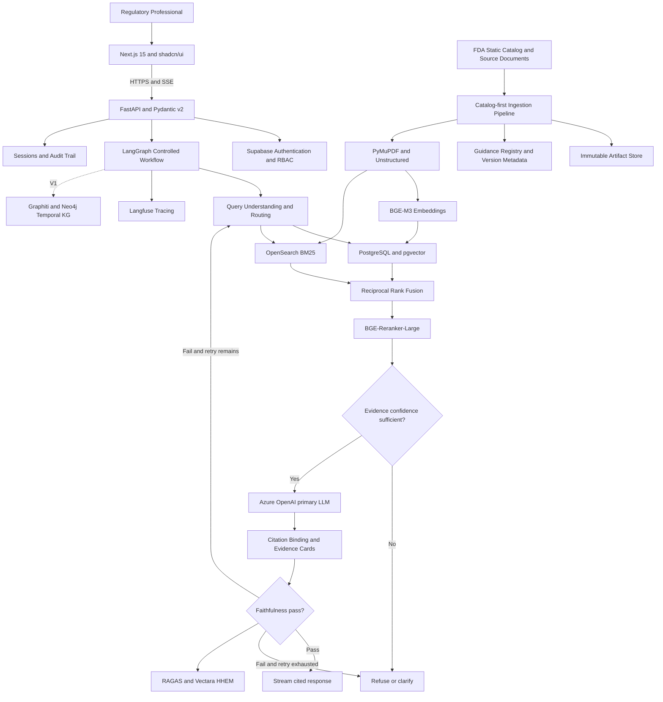
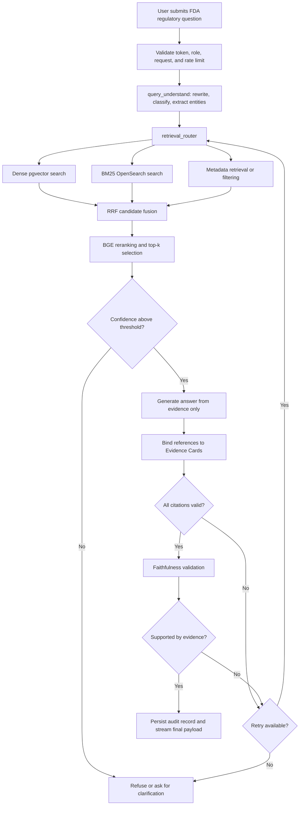
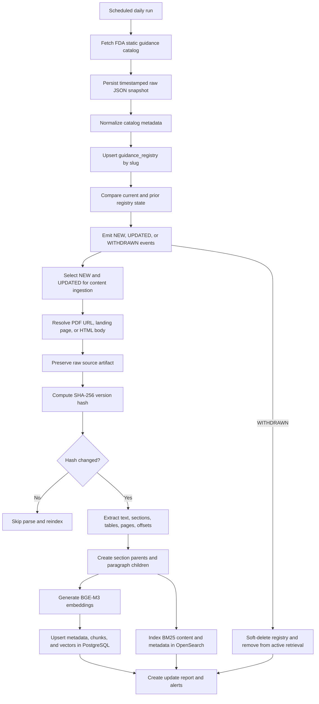
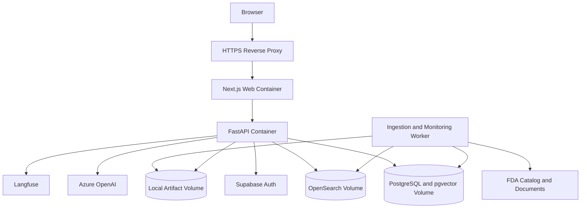

# Solution Design Document

## Project Name

**FDA Regulatory Intelligence Platform (RegRAG)**

## Document Control

| Item | Value |
|---|---|
| Document Type | Solution Design Document |
| Solution | FDA Regulatory Intelligence Platform |
| Repository | `faizan-as/RegRAG` |
| Architecture Style | Citation-first Hybrid RAG with Controlled Agentic Workflow |
| Current Release | MVP, with V1 temporal knowledge graph extension |
| Primary Audience | Solution architects, engineering teams, regulatory professionals, security reviewers, platform operations, and product stakeholders |
| Status | Design baseline aligned to repository README, architecture workflow, and project plan |

## 1. Executive Summary

The **FDA Regulatory Intelligence Platform**, also referred to as **RegRAG**, is a citation-first, AI-powered platform that enables regulatory professionals to search, investigate, summarize, and ask natural-language questions across United States Food and Drug Administration guidance documents.

The platform combines deterministic document lifecycle management, hybrid retrieval, controlled LLM orchestration, explicit evidence binding, and automated faithfulness validation. Its non-negotiable design principle is:

> **Every generated answer must include a verifiable FDA citation.**

The MVP uses **Next.js 15**, **FastAPI**, **LangGraph**, **PostgreSQL with pgvector**, **OpenSearch**, **BGE-M3 embeddings**, **BGE-Reranker-Large**, and an LLM provider abstraction led by **Azure OpenAI**. The system retrieves evidence through dense vector search and BM25 keyword search, fuses the results using Reciprocal Rank Fusion, reranks the candidate passages, evaluates retrieval confidence, generates a grounded answer, binds each citation to an Evidence Card, and verifies faithfulness before returning the response.

The platform is designed to accelerate regulatory research without replacing professional or legal judgment. It does not make compliance decisions, provide legal advice, or autonomously approve regulatory submissions. Instead, it provides defensible research support with source traceability, document-version awareness, low-confidence refusal, and auditable records.

A future V1 extension introduces **Graphiti and Neo4j** for temporal knowledge graphs, cross-guidance reasoning, document-evolution timelines, and entity-centric exploration. This capability is deliberately deferred until the hybrid RAG foundation is stable and trusted.

## 2. Business Context

Regulatory professionals must continuously interpret a large and changing body of FDA guidance. Research frequently spans multiple documents, centers, product categories, dockets, CFR references, publication dates, and document statuses. Traditional keyword search can identify documents, but it does not consistently provide synthesized, context-aware answers or explain how a conclusion maps to exact regulatory text.

Key business challenges include:

- FDA guidance is distributed across landing pages, PDFs, metadata catalogs, and historical versions.
- Regulatory language is precise, domain-specific, and sensitive to document status and publication date.
- Relevant evidence may use exact legal or scientific terminology that semantic-only search can miss.
- Reviewers need the exact section, page, passage, source URL, and document version behind every answer.
- Draft, final, revised, and withdrawn guidance must not be treated as equivalent.
- Manual monitoring of new, changed, and withdrawn guidance is time-consuming.
- Unsupported AI answers create unacceptable trust and compliance risks.
- Teams need reproducible research outputs that can be exported for internal review.

RegRAG addresses these challenges through a controlled regulatory intelligence experience backed by preserved source artifacts, version hashes, hybrid evidence retrieval, citation binding, refusal guardrails, and a full query-and-answer audit trail.

## 3. Business Outcomes and Success Measures

The solution targets the following outcomes:

1. Reduce time spent discovering and reviewing relevant FDA guidance.
2. Improve evidence traceability by linking every generated answer to verifiable source passages.
3. Detect and communicate new, updated, status-changed, and withdrawn guidance daily.
4. Reduce hallucination risk through grounded generation, confidence thresholds, bounded retries, and faithfulness validation.
5. Provide a reusable regulatory research workspace for search, Q&A, summaries, key requirements, and exports.
6. Create a trusted architecture that can later support cross-guidance reasoning and document-evolution intelligence.

### 3.1 Target Metrics

| Metric | Target |
|---|---:|
| Citation coverage | 100% of generated answers include at least one Evidence Card |
| Citation validity | 100% resolve to source, section/page, passage, version hash, and URL |
| Retrieval recall@10 | At least 90% on the curated FDA gold set |
| Grounded accuracy | At least 95% on curated FDA Q&A |
| Hallucination rate | At most 5% using HHEM and faithfulness evaluation |
| Standard Q&A latency | Under 5 seconds on the pilot corpus |
| Content freshness | Daily detection of new, updated, and withdrawn guidance |
| Weekly active adoption | At least 60% during pilot |
| Pilot NPS | At least 40 |

Metric thresholds are release gates rather than aspirational-only indicators. A release that fails citation integrity, retrieval quality, refusal behavior, or freshness must not be promoted.

## 4. Solution Objectives

The platform shall:

- Ingest FDA guidance metadata and source documents through a catalog-first pipeline.
- Preserve original catalog snapshots, PDFs, HTML fallback content, and document versions.
- Parse text, sections, tables, page numbers, and character offsets.
- Maintain document lifecycle status, including Draft, Final, and Withdrawn.
- Generate BGE-M3 embeddings and index child chunks in PostgreSQL with pgvector.
- Index text and filterable metadata in OpenSearch for BM25 retrieval.
- Combine dense and sparse results through Reciprocal Rank Fusion.
- Rerank fused candidates with BGE-Reranker-Large.
- Answer regulatory questions exclusively from selected evidence.
- Bind every citation to a structured Evidence Card.
- Refuse or request clarification when evidence confidence is insufficient.
- Validate answer faithfulness before final delivery.
- Provide streaming responses, source navigation, highlighted passages, summaries, alerts, and exports.
- Capture operational, retrieval, model, security, and audit telemetry.

## 5. Scope

### 5.1 MVP Scope

- FDA guidance documents only.
- Static FDA guidance catalog synchronization.
- PDF ingestion with landing-page and HTML fallback handling.
- Metadata normalization and guidance registry management.
- SHA-256 version tracking and lifecycle transition detection.
- Parent-child chunking with section and page traceability.
- Dense retrieval using PostgreSQL and pgvector.
- Keyword retrieval using OpenSearch BM25.
- Metadata filters for center, topic, date, status, docket, CFR, and product code.
- Reciprocal Rank Fusion and cross-encoder reranking.
- Citation-first regulatory Q&A with Evidence Cards.
- Confidence checks, bounded retry, faithfulness guard, and refusal behavior.
- Streaming chat and search user experience.
- Document viewer with cited-passage highlighting and section navigation.
- Guidance summaries, key requirements, and key-changes generation.
- Word/PDF summary and chat-transcript export.
- Daily update monitoring and alert records.
- Authentication, role-based access, audit persistence, and API protection.
- Langfuse tracing and gold-set quality evaluation.

### 5.2 V1 Scope

- Graphiti and Neo4j temporal knowledge graph.
- Cross-guidance comparison.
- Draft-versus-final analysis and visualization.
- Document-evolution timelines.
- Entity-centric reasoning across centers, CFR references, dockets, product codes, and topics.
- Relationship types such as `SUPERSEDES`, `CITES`, `APPLIES_TO`, and `REVISED_FROM`.

### 5.3 Out of Scope

- Legal advice or automated compliance decisions.
- Autonomous regulatory submission approval.
- Full Regulatory Information Management workflow replacement.
- FDA Warning Letter and Form 483 analysis in the MVP.
- Coverage of EMA, PMDA, or other regulators in the MVP.
- Training a proprietary foundation model.
- Unbounded autonomous agent tool selection.
- Fine-tuned proprietary LLMs in the MVP.
- Multi-tenant enterprise SaaS controls in the initial pilot.

## 6. Stakeholders and User Roles

| Role | Responsibilities and Access |
|---|---|
| Regulatory Researcher | Searches guidance, asks questions, opens evidence, creates summaries, and exports research outputs. |
| Regulatory Affairs Specialist | Assesses requirements, status, applicability, and version changes using cited evidence. |
| Regulatory Reviewer | Reviews generated findings and validates source passages before downstream use. |
| Platform Administrator | Manages users, roles, configuration, health, alerts, and audit access. |
| Data/Content Administrator | Operates the FDA ingestion pipeline, resolves failures, and monitors freshness. |
| AI Platform Engineer | Tunes retrieval, prompts, thresholds, evaluation sets, models, and guardrails. |
| Security and Compliance Reviewer | Reviews access, audit trails, secrets, vulnerabilities, and data handling. |
| Product Owner | Prioritizes use cases, quality targets, pilot feedback, and release gates. |

The platform recognizes two MVP application roles: **researcher** and **admin**. Authorization is derived from trusted JWT application metadata. Users without an explicit application role are treated as researchers, while administrative workflows require the admin role.

## 7. Key Use Cases

1. **Regulatory Q&A:** Ask a question and receive a concise, sourced answer with Evidence Cards.
2. **Guidance discovery:** Search by natural language, exact terms, center, topic, date, status, docket, CFR, or product code.
3. **Source verification:** Open the FDA source and navigate directly to the cited page, section, and passage.
4. **Document summarization:** Generate grounded summaries and key requirements for a selected guidance.
5. **Change intelligence:** Identify new, changed, status-transitioned, and withdrawn guidance.
6. **Version review:** Compare tracked metadata and document versions, with fuller semantic comparison in V1.
7. **Research export:** Export summaries and chat transcripts for internal review and documentation.
8. **Operational administration:** Inspect ingestion jobs, alerts, health checks, failed operations, and audit records.

## 8. Functional Requirements

### 8.1 Ingestion and Document Management

- Synchronize the FDA static guidance JSON catalog daily.
- Store immutable, timestamped raw catalog snapshots.
- Normalize HTML-escaped metadata into the guidance registry.
- Detect NEW, UPDATED, and WITHDRAWN events.
- Resolve source content using PDF link, landing-page fallback, or HTML content.
- Preserve raw source files and metadata.
- Compute a SHA-256 content hash and skip reprocessing if unchanged.
- Record version snapshots and supersession relationships.
- Parse text, sections, tables, pages, and offsets.
- Create parent and child chunks preserving document hierarchy.
- Reindex only changed documents and remove withdrawn content from active retrieval.

### 8.2 Search and Retrieval

- Execute dense and keyword retrieval concurrently where possible.
- Apply equivalent metadata filters across PostgreSQL and OpenSearch.
- Support dense-only or keyword-only degraded operation when one retrieval store is unavailable.
- Fuse ranked lists using Reciprocal Rank Fusion.
- Rerank top candidates using BGE-Reranker-Large.
- Return Evidence Card-ready payloads with every search result.

### 8.3 AI Answering

- Understand and normalize the user query.
- Extract entities such as drug/device, center, CFR, docket, product code, status, and date.
- Classify query intent and select the controlled retrieval path.
- Calculate retrieval confidence before generation.
- Generate only from approved context.
- Bind citations to existing Evidence Card identifiers.
- Reject invented, incomplete, or unbound citations.
- Validate faithfulness and retry within configured limits.
- Refuse low-confidence or unsupported requests.
- Clearly state that outputs support research and do not constitute legal or compliance advice.

### 8.4 User Experience

- Authenticate users before accessing protected features.
- Provide streaming responses using Server-Sent Events.
- Render answer citations and evidence cards incrementally or at completion.
- Enable source-passage navigation and highlighting.
- Preserve research sessions and chat history subject to retention policy.
- Support summaries, key requirements, key changes, and exports.
- Show user-friendly states for refusal, degraded retrieval, and service failure.

### 8.5 Monitoring and Administration

- Display or expose ingestion status and latest successful synchronization.
- Create alert records for document changes.
- Record query, retrieval, generation, citation, validation, and response events.
- Provide liveness and readiness endpoints.
- Restrict audit and alert-management workflows to administrators.

## 9. Non-Functional Requirements

| Category | Requirement |
|---|---|
| Accuracy | Meet grounded-answer and retrieval quality gates on the FDA gold set. |
| Traceability | Every answer and summary must resolve to preserved source evidence. |
| Performance | Standard pilot Q&A should complete in under five seconds, excluding exceptional provider delays. |
| Availability | Pilot deployment must expose health and readiness checks and support controlled restart and recovery. |
| Scalability | API and workers remain stateless where possible; stores scale independently in later deployment stages. |
| Security | Secrets externalized, JWT validated, RBAC enforced, inputs validated, and endpoints rate limited. |
| Auditability | Query, evidence, model route, prompt version, answer, confidence, and validation result recorded. |
| Maintainability | Clear separation between ingestion, retrieval, orchestration, API, UI, reports, monitoring, and evaluation. |
| Resilience | Retrieval and LLM fallbacks are bounded, observable, and fail safe. |
| Portability | Deployment packaged in containers, with provider and storage adapters behind interfaces. |
| Accessibility | UI should support keyboard navigation, readable evidence cards, and accessible status messages. |
| Privacy | Do not include secrets or unnecessary personal information in prompts, traces, or exports. |

## 10. High-Level Architecture



## 11. Architecture Layers

### 11.1 Presentation Layer

The presentation layer uses **Next.js 15**, **React**, and **shadcn/ui**. It provides authenticated search, streaming chat, document inspection, citation navigation, summaries, exports, alerts, and administrative views.

Key responsibilities:

- Session establishment and protected navigation.
- Query submission and SSE consumption.
- Streaming answer rendering.
- Evidence Card display.
- Source highlighting and section navigation.
- Search filtering and result exploration.
- Summary and export actions.
- Clear warning, refusal, degraded-service, and error states.

The UI must never present an AI answer as authoritative without its citations. Citation loading or binding failure must be visible and must prevent a normal answer-complete state.

### 11.2 API Layer

The API layer is implemented using **FastAPI**, **Pydantic v2**, async dependencies, and **SSE**.

Representative endpoint groups:

- `/chat` for streaming cited Q&A.
- `/search` for hybrid search.
- `/documents` for document metadata and source navigation.
- `/summaries` for grounded summaries and key requirements.
- `/exports` for report and transcript generation.
- `/alerts` for update monitoring.
- `/health` for liveness.
- `/ready` for dependency-aware readiness.

API responsibilities include authentication, authorization, validation, dependency injection, rate limiting, correlation IDs, session persistence, audit creation, exception normalization, and streaming lifecycle management.

### 11.3 AI Orchestration Layer

The AI workflow uses **LangGraph** to provide explicit state, nodes, edges, retries, and guardrails. It avoids unconstrained autonomous tool use.

The typed state carries:

- Original and rewritten query.
- Intent and extracted entities.
- Metadata filters.
- Dense and sparse candidates.
- Fused and reranked evidence.
- Confidence scores.
- Retry counters.
- Draft answer and citation references.
- Evidence Cards.
- Faithfulness outcome.
- Refusal reason and final response.

### 11.4 Retrieval Layer

The retrieval layer combines two complementary search modes:

- **PostgreSQL + pgvector:** semantic retrieval over BGE-M3 embeddings.
- **OpenSearch:** BM25 keyword retrieval for exact terminology, identifiers, CFR citations, docket values, and phrase matching.

Reciprocal Rank Fusion combines rankings without requiring comparable raw scores. BGE-Reranker-Large then applies a cross-encoder to improve precision in the final evidence set. Shared filter semantics prevent inconsistent results between stores.

### 11.5 Knowledge and Model Layer

- **BGE-M3** produces 1024-dimensional embeddings.
- **BGE-Reranker-Large** scores query-passage relevance.
- **Azure OpenAI** is the primary generation provider.
- Provider wrappers allow Claude Sonnet or an OpenAI-compatible vLLM endpoint serving Llama 3.3 or Qwen as controlled fallbacks.
- Provider routing must preserve prompt, citation, safety, logging, timeout, and schema contracts.

### 11.6 Data Processing and Ingestion Layer

The ingestion design is two-tier and catalog-first:

- Tier 1 performs a low-cost daily catalog synchronization and change detection.
- Tier 2 processes source content only for new or updated records.

This design minimizes unnecessary downloads, parsing, embeddings, and indexing while maintaining corpus freshness.

### 11.7 Platform Services Layer

- **Supabase Auth:** identity and JWT issuance for the MVP.
- **PostgreSQL:** registry, artifact metadata, versions, chunks, sessions, audit, and alert records.
- **Local artifact storage:** pilot storage for immutable source artifacts and reports.
- **Langfuse:** traces, prompt/model spans, timing, and quality observations.
- **RAGAS and Vectara HHEM:** evaluation and hallucination/faithfulness measurements.

## 12. End-to-End Query Workflow



### 12.1 LangGraph Node Responsibilities

| # | Node | Responsibility |
|---:|---|---|
| 1 | `query_understand` | Rewrites the query, classifies intent, and extracts regulatory entities. |
| 2 | `retrieval_router` | Selects hybrid, metadata-constrained, or future graph-enhanced retrieval. |
| 3 | `hybrid_retrieve` | Runs pgvector dense retrieval and OpenSearch BM25 search. |
| 4 | `graph_retrieve` | V1-only retrieval for temporal, entity, and cross-document relationships. |
| 5 | `merge_rerank` | Fuses candidates and reranks the final evidence set. |
| 6 | `confidence_check` | Assesses retrieval sufficiency and routes weak evidence to refusal. |
| 7 | `generate_answer` | Produces a citation-first response from approved evidence only. |
| 8 | `citation_bind` | Resolves answer references to exact Evidence Cards. |
| 9 | `faithfulness_guard` | Tests whether answer claims are supported by retrieved passages. |
| 10 | `respond` | Returns answer, citations, evidence, confidence, and response metadata. |

## 13. FDA Ingestion and Update Workflow



### 13.1 Catalog Synchronization

The FDA static JSON catalog is the authoritative discovery mechanism for the MVP. It is fetched daily, stored unchanged as a timestamped artifact, normalized, and compared with the prior snapshot. The registry is keyed by document slug, with docket ID as a secondary identifier where available.

Normalized fields include title, slug, status, center, communication type, topics, regulated product, docket, issue date, comment window, and changed timestamp.

### 13.2 Content Resolution and Preservation

For new or changed records, the pipeline resolves content in this order:

1. Direct PDF link from the feed or known metadata.
2. PDF discovered from the FDA landing page.
3. FDA landing-page HTML body as a fallback.

The raw source is preserved before transformation. The artifact record stores backend, object key, media type, size, source URL, document slug, SHA-256, version hash, and timestamps.

### 13.3 Parsing and Chunking

**PyMuPDF** extracts text and page-aware coordinates. **Unstructured** supplements layout and table extraction. The parser normalizes headings and retains section, page, and character offsets.

A parent-child strategy is used:

- Parent chunks represent coherent sections and supply wider generation context.
- Child chunks represent paragraphs or smaller passages and support accurate retrieval.
- Child records retain parent, section, page, and version references.

### 13.4 Idempotency and Change Handling

- Catalog sync uses repeatable upserts.
- Content processing is idempotent by SHA-256 version hash.
- Unchanged documents are not re-parsed or re-embedded.
- Updated documents receive a new version snapshot.
- Active indexes are refreshed only for changed documents.
- Withdrawn documents are excluded from normal active retrieval while preserved for audit and historical analysis.

## 14. Retrieval and Ranking Design

### 14.1 Dense Retrieval

The user query is embedded using the same BGE-M3 configuration used for document chunks. pgvector executes cosine-distance search against the `guidance_chunks` vector column. An HNSW index supports approximate nearest-neighbor search.

Dense retrieval is strongest for paraphrased concepts, semantic similarity, and questions whose wording differs from the source.

### 14.2 Sparse Retrieval

OpenSearch BM25 searches normalized text and selected metadata. Sparse retrieval is essential for exact FDA terminology, CFR references, dockets, product codes, named guidance, section names, and uncommon scientific phrases.

### 14.3 Metadata Filtering

Filters may include:

- FDA center.
- Guidance status.
- Topic.
- Issue or changed date range.
- Docket.
- CFR reference.
- Product code or regulated product.

Equivalent filters must be applied to dense and sparse stores before fusion whenever practical.

### 14.4 Fusion and Reranking

Reciprocal Rank Fusion merges dense and BM25 rankings. A configurable candidate window is sent to BGE-Reranker-Large, which calculates query-passage relevance. The final top-k evidence set is selected using rerank score, source diversity, metadata constraints, and configured confidence rules.

### 14.5 Degraded Retrieval

If one store is temporarily unavailable, the retrieval client may continue with the other store when policy permits. The response and trace must record degraded mode. High-risk queries or insufficient evidence must still be refused.

## 15. Citation and Evidence Design

Citation integrity is the central trust contract of the solution. Each answer-local citation such as `[1]` resolves to a structured Evidence Card.

### 15.1 Evidence Card Schema

| Field | Purpose |
|---|---|
| `citation_id` | Stable answer-local marker. |
| `document_id` | Stable internal FDA document identifier. |
| `title` | FDA guidance title. |
| `section_id` | Normalized section identifier, if available. |
| `section_title` | Human-readable section heading. |
| `page_number` | PDF page for source inspection. |
| `passage` | Exact source passage supporting the answer. |
| `source_url` | Canonical FDA source URL. |
| `version_hash` | SHA-256 identifier for the cited source version. |
| `document_status` | Draft, Final, or Withdrawn. |
| `retrieval_score` | Retrieval-stage score or component scores. |
| `rerank_score` | Cross-encoder relevance score. |
| `confidence` | Final evidence confidence used by guardrails. |
| `retrieved_at` | Retrieval timestamp for auditability. |

### 15.2 Fail-Closed Citation Binding

The model is permitted to reference only preassigned Evidence Card identifiers. Binding fails if a citation is missing, invented, references an unavailable passage, or does not correspond to the current document version. The workflow then retries retrieval/generation within a bounded limit or returns a refusal.

### 15.3 Source Navigation

The UI uses Evidence Card fields to open the document, navigate to the relevant page or section, and highlight the supporting passage. The user must be able to inspect context beyond the quoted passage.

## 16. Data Architecture

### 16.1 PostgreSQL Responsibilities

A single MVP PostgreSQL database consolidates relational metadata and dense vectors.

Core logical entities:

- `guidance_registry`: normalized FDA catalog record and lifecycle status.
- `source_artifacts`: immutable artifact metadata and storage keys.
- `guidance_versions`: document version snapshots and supersession metadata.
- `guidance_chunks`: parent/child chunks, offsets, embeddings, and Evidence Card payloads.
- `sessions`: user research sessions.
- `queries`: normalized query and processing metadata.
- `answers`: final or refused answer record.
- `evidence_usage`: answer-to-Evidence Card mapping.
- `alerts`: new, updated, and withdrawn guidance notifications.
- `audit_events`: security, workflow, and administrative actions.
- `ingestion_runs`: job status, counts, checkpoints, and failures.

### 16.2 OpenSearch Index

The guidance index contains:

- Chunk text.
- Document and version identifiers.
- Title and section metadata.
- Status, center, topic, docket, CFR, product code, and dates.
- Page and passage offsets.
- Artifact and source references.

Mappings must distinguish full-text fields, keyword fields, dates, and identifiers. Index aliases should support safe reindexing and controlled rollback.

### 16.3 Artifact Store

The MVP uses a local filesystem volume through a storage abstraction. Suggested keys include:

```text
catalog/search-for-guidance/<timestamp>.json
raw/<slug>/<sha256>.pdf
raw/<slug>/<sha256>.html
reports/updates/<date>.json
exports/<user-or-session>/<export-id>.pdf
```

Only relative object keys are persisted. S3, MinIO, or Azure Blob Storage can later implement the same interface without changing domain logic.

### 16.4 Data Retention

Retention must be policy-driven:

- Source artifacts and version hashes retained for regulatory traceability.
- Query and answer records retained according to organizational audit requirements.
- Detailed LLM traces redacted and retained only as long as necessary.
- User exports expire or are archived according to workspace policy.
- Withdrawn guidance remains historically discoverable only in explicitly selected historical modes.

## 17. API and Integration Design

### 17.1 API Principles

- REST endpoints for resource operations.
- SSE for token and workflow-event streaming.
- Pydantic schemas at ingress and egress.
- Async I/O and connection pooling.
- Correlation IDs across API, LangGraph, retrieval, LLM, and audit events.
- Idempotency keys for long-running summary/export operations where appropriate.
- Explicit versioning for public contracts.

### 17.2 Streaming Contract

A streaming request may emit:

1. Request accepted.
2. Query interpreted.
3. Retrieval in progress.
4. Evidence selected.
5. Answer token or content delta.
6. Citations and Evidence Cards.
7. Validation outcome.
8. Final answer metadata or refusal.

The client must treat only the final validated event as completion. Draft tokens must not be persisted as an approved answer if validation later fails.

### 17.3 Error Handling

Errors are categorized as validation, authentication, authorization, rate limit, dependency unavailable, retrieval insufficient, citation failure, faithfulness failure, timeout, and internal failure. User messages remain safe and actionable; detailed stack traces remain in protected logs.

## 18. Security Architecture

### 18.1 Identity and Access

- Supabase provides MVP authentication and JWTs.
- The API validates issuer, audience, signature, expiry, and required claims.
- Application roles come from trusted `app_metadata.roles`, not user-editable metadata.
- Least privilege is applied to researcher and administrator permissions.
- Administrative audit and alert actions require explicit authorization.

### 18.2 Secrets and Configuration

- No credential is hardcoded or committed.
- Secrets are injected through environment variables for local/pilot use and should move to a managed secret store for enterprise deployment.
- Separate development, staging, and pilot configurations and data volumes are required.
- Secret values must be redacted from logs and traces.

### 18.3 Application and API Security

- Pydantic validation at every boundary.
- Parameterized database operations and safe filter construction.
- OpenSearch query allow-listing and escaping.
- File type, size, content, and source-domain validation.
- API rate limiting and request-size limits.
- Secure CORS allow-list.
- Security headers, TLS, and secure cookies where applicable.
- Dependency and container vulnerability scanning.
- Audit logging for privileged operations.

### 18.4 Prompt Injection and Untrusted Content

FDA source documents are treated as untrusted data, not instructions. The generation prompt separates system policy, user question, and retrieved evidence. The workflow ignores instructions embedded in documents, limits available tools, blocks arbitrary URL access during generation, and validates output citations against server-side Evidence Cards.

### 18.5 Network Security

The single-VM pilot may use an internal container network and expose only required web/API ingress. Enterprise deployment should use private endpoints, managed identities, network security groups, Web Application Firewall controls, restricted egress, and centralized certificate management.

## 19. Responsible AI and Regulatory Guardrails

1. **Grounding:** Generated answers use only selected FDA evidence.
2. **Citation requirement:** No final answer without at least one valid Evidence Card.
3. **Confidence control:** Weak or conflicting evidence triggers clarification or refusal.
4. **Faithfulness validation:** Claims are evaluated against retrieved passages.
5. **Bounded retry:** The system cannot loop or repeatedly regenerate without limit.
6. **Professional-use boundary:** Responses support research and do not constitute legal advice or compliance decisions.
7. **Status awareness:** Draft, final, and withdrawn documents are explicitly identified.
8. **Version awareness:** Citations include document version hash and retrieval timestamp.
9. **Transparency:** Model route, retrieval path, confidence, and evidence can be audited.
10. **Human review:** Regulatory professionals remain accountable for interpretation and downstream action.

### 19.1 Refusal Conditions

The platform refuses or asks for clarification when:

- No relevant evidence is found.
- Evidence confidence is below threshold.
- Sources conflict and cannot be reconciled safely.
- Citation binding fails.
- Faithfulness validation fails after allowed retry.
- The question requests legal advice or a definitive compliance decision.
- Required metadata constraints are ambiguous.
- Dependencies are degraded to a level that prevents reliable output.

## 20. Observability and AgentOps

### 20.1 Trace Design

Langfuse traces should link the following spans:

- API request and authenticated actor.
- Query understanding.
- Retrieval route and filters.
- Dense and BM25 calls.
- RRF fusion and reranking.
- Confidence calculation.
- LLM provider and prompt version.
- Citation binding.
- Faithfulness evaluation.
- Retry/refusal decision.
- Final response latency and token usage.

Sensitive fields and secrets must be removed or masked before traces are persisted.

### 20.2 Operational Metrics

- Request rate, errors, and latency percentiles.
- SSE connection duration and disconnects.
- Retrieval-store availability and query latency.
- Dense/sparse overlap and degraded-mode frequency.
- Reranker latency and score distribution.
- LLM latency, tokens, failures, and fallback rate.
- Citation-binding failure rate.
- Low-confidence and refusal rates.
- Faithfulness-pass and retry rates.
- Daily ingestion duration, change counts, and failures.
- Corpus freshness and last successful sync.

### 20.3 Evaluation

A curated FDA gold set drives offline and nightly evaluation. It should cover centers, document statuses, exact identifier queries, semantic questions, ambiguous questions, unsupported questions, and known version changes.

Evaluation includes:

- Recall@k, precision@k, and MRR for retrieval.
- Reranker lift over fused retrieval.
- Citation coverage and validity.
- Answer correctness and relevance.
- RAGAS faithfulness.
- Vectara HHEM hallucination assessment.
- Refusal precision and recall.
- Latency and cost by workflow stage.

Prompt, model, embedding, chunking, filter, and threshold changes must be evaluated against a fixed baseline before promotion.

## 21. Performance and Scalability

### 21.1 Performance Controls

- Async retrieval and API operations.
- Connection pools for PostgreSQL and OpenSearch.
- Concurrent dense and BM25 search.
- Metadata pre-filtering.
- HNSW vector index.
- Embedding and reranking batches.
- Cached immutable parsed content and embeddings.
- Incremental reindexing by version hash.
- Configurable top-k and rerank candidate windows.
- Streaming to improve perceived response time.

### 21.2 Scaling Path

The MVP uses Docker Compose on a single VM. As usage grows:

1. Move artifact storage to Azure Blob Storage or equivalent.
2. Move PostgreSQL to a managed service with pgvector support.
3. Use managed OpenSearch or Azure-compatible search alternatives based on platform standards.
4. Separate web, API, ingestion worker, and scheduler workloads.
5. Introduce queue-based ingestion and export processing.
6. Deploy containers to Azure Container Apps or AKS based on scale, networking, and operational requirements.
7. Add horizontal autoscaling and distributed tracing.
8. Introduce tenant isolation only after data and authorization models are formally designed.

## 22. Reliability, Backup, and Disaster Recovery

### 22.1 Failure Handling

- Retrieval store failures invoke controlled single-store fallback when safe.
- LLM provider failures may route to configured fallbacks with identical output contracts.
- Ingestion jobs use checkpoints and idempotency to resume safely.
- Failed artifacts enter a retry/dead-letter workflow for operator review.
- Repeated citation or validation failure returns refusal rather than an unverified answer.

### 22.2 Backup Scope

Backups include:

- PostgreSQL metadata, vectors, sessions, and audit records.
- Raw catalog snapshots and FDA source artifacts.
- Generated reports where retention requires preservation.
- OpenSearch indexes or reproducible snapshots.
- Configuration metadata excluding secrets.
- Langfuse data subject to observability retention policy.

OpenSearch is rebuildable from preserved parsed content and metadata, but recovery time should be tested. Backup restoration must be exercised, not assumed.

### 22.3 Recovery Targets

Pilot RPO and RTO must be agreed with stakeholders. A reasonable initial design target is daily backup with an RPO of 24 hours and an RTO of 8 hours, followed by tighter targets for production based on business criticality.

## 23. Deployment Architecture

### 23.1 MVP Pilot Deployment



The pilot requires persistent volumes for PostgreSQL, OpenSearch, artifacts, and Langfuse. Development, staging, and pilot environments use separate configuration and data.

### 23.2 Enterprise Azure Evolution

For enterprise deployment, recommended Azure mappings include:

- Azure Front Door or Application Gateway with WAF.
- Azure Container Apps or AKS for web, API, and workers.
- Azure Database for PostgreSQL with pgvector support.
- Azure Blob Storage for artifacts and exports.
- Azure OpenAI for primary generation.
- Azure Key Vault for secrets and certificates.
- Microsoft Entra ID as enterprise identity provider.
- Azure Monitor, Application Insights, and Log Analytics integrated with Langfuse.
- Private networking, private endpoints, managed identity, and controlled egress.

Product compatibility and service availability must be validated during the detailed cloud deployment design.

## 24. CI/CD and Environment Strategy

### 24.1 Pipeline Stages

1. Format and lint Python and TypeScript.
2. Run unit tests.
3. Run retrieval, workflow, API, and UI integration tests.
4. Scan dependencies, secrets, source, and container images.
5. Build versioned container images.
6. Apply database migration checks.
7. Deploy to development.
8. Run smoke and contract tests.
9. Deploy to staging and execute gold-set evaluation.
10. Require approval when quality and security gates pass.
11. Deploy to pilot/production with rollback support.

### 24.2 Configuration Strategy

Environment-specific values remain outside source code. Feature flags control local demo adapters, provider fallback, V1 graph retrieval, and experimental prompts. `LOCAL_DEMO_MODE` is permitted only in development and must fail startup in staging or pilot.

### 24.3 Database Migrations

Alembic migrations are version-controlled and run as an explicit deployment step. Destructive changes require backup, compatibility planning, and rollback or forward-fix procedures.

## 25. Testing Strategy

### 25.1 Unit Tests

- Catalog normalization and change detection.
- URL resolution and hashing.
- Parsing and chunk boundaries.
- Embedding interfaces and index payloads.
- Dense, BM25, filters, RRF, and reranking.
- Confidence scoring and refusal logic.
- Citation binding and schema validation.
- Faithfulness and retry routing.
- Authorization and role enforcement.

### 25.2 Integration Tests

- Catalog-to-index ingestion.
- PostgreSQL and OpenSearch retrieval consistency.
- End-to-end LangGraph execution.
- API streaming and disconnect behavior.
- Authentication and protected routes.
- Summary/export source traceability.
- Update event and alert creation.

### 25.3 End-to-End Tests

- Researcher login, query, citations, and source navigation.
- Admin audit and alert workflows.
- Unsupported query refusal.
- Updated or withdrawn guidance handling.
- Exported report containing verifiable references.

### 25.4 Non-Functional Tests

- Load and concurrency testing.
- Retrieval and response latency.
- Failover and degraded-mode behavior.
- Backup and restore drills.
- Security, dependency, and container scans.
- Prompt-injection and malicious-document tests.
- Accessibility testing.

## 26. Implementation Roadmap

### Phase 1: Foundation

- Establish repository structure and coding standards.
- Configure Docker Compose, PostgreSQL/pgvector, OpenSearch, FastAPI, and common schemas.
- Implement configuration, logging, error handling, and storage interfaces.

### Phase 2: Catalog-First Ingestion

- Implement FDA catalog synchronization and registry.
- Add source resolution, artifact preservation, SHA-256 versioning, parsing, chunking, embeddings, and dual indexing.
- Schedule daily synchronization with APScheduler.

### Phase 3: Retrieval and Reranking

- Implement dense and BM25 search.
- Normalize shared filters.
- Add RRF, reranking, Evidence Card payloads, and degraded retrieval.

### Phase 4: Controlled Agent Workflow

- Implement typed LangGraph state and nodes.
- Add query understanding, routing, confidence, generation, citation binding, faithfulness, retry, and refusal.
- Introduce provider-neutral streaming and fallbacks.

### Phase 5: API and Frontend

- Deliver streaming API endpoints.
- Build authenticated Next.js chat, search, viewer, summary, export, and alert experiences.
- Persist sessions, answers, evidence use, and audit events.

### Phase 6: Evaluation and Observability

- Integrate Langfuse.
- Curate the FDA gold set.
- Add RAGAS and HHEM evaluation.
- Establish dashboards, alerts, and nightly regression.

### Phase 7: MVP Hardening and Pilot

- Address retrieval and citation failures.
- Complete security, performance, backup, and operational runbooks.
- Run release gates and deploy a controlled pilot corpus.

### V1: Temporal Knowledge Graph

- Introduce Neo4j and Graphiti.
- Define the FDA ontology and episode ingestion.
- Add graph retrieval only for cross-guidance, temporal, and entity-centric intent.
- Maintain hybrid retrieval as the authoritative evidence path.

## 27. Risks and Mitigations

| Risk | Impact | Mitigation |
|---|---|---|
| FDA page or catalog structure changes | Ingestion failure or stale corpus | Snapshot inputs, schema validation, monitoring, fallback resolution, and rapid adapter updates. |
| Poor PDF quality or complex tables | Missing or distorted evidence | PyMuPDF plus Unstructured, parser quality checks, page offsets, and manual exception workflow. |
| Retrieval misses relevant evidence | Incorrect refusal or incomplete answer | Hybrid search, metadata filters, gold-set tuning, reranking, and query rewriting. |
| Hallucinated or fabricated citation | Loss of trust and compliance risk | Preassigned Evidence Card IDs, fail-closed binding, faithfulness guard, and refusal. |
| Draft or withdrawn guidance used incorrectly | Misleading regulatory interpretation | Status-aware filters, visible status labels, version metadata, and active/historical modes. |
| Cross-store inconsistency | Contradictory results | Shared filters, version-hash payloads, idempotent dual-indexing, reconciliation jobs, and alerts. |
| LLM provider outage or behavior change | Unavailability or quality regression | Provider abstraction, controlled fallback, timeouts, regression evaluation, and model-version pinning. |
| Sensitive data in traces | Privacy or security exposure | Data minimization, masking, access control, and retention policy. |
| Single-VM pilot limitations | Resource contention and downtime | Capacity thresholds, persistent backups, health checks, and documented managed-cloud scaling path. |
| Evaluation set bias | Overstated quality | Diverse expert-curated questions, adversarial cases, versioned datasets, and human review. |
| Knowledge graph complexity | Delayed MVP and operational burden | Defer Graphiti/Neo4j until hybrid RAG achieves quality gates. |

## 28. Cost Optimization

- Use catalog diffs to process only new and changed documents.
- Avoid re-embedding unchanged files through version hashing.
- Batch embeddings and reranking.
- Keep top-k and rerank windows evidence-driven.
- Cache immutable parsing and embedding outputs.
- Use smaller models for query understanding or classification when quality permits.
- Invoke the primary LLM only after retrieval confidence succeeds.
- Refuse before generation when evidence is inadequate.
- Apply trace sampling or retention controls without losing audit-critical events.
- Use local pilot storage initially, then move to managed services according to scale and operational cost.
- Defer graph infrastructure until user value and use cases justify it.

## 29. Assumptions, Constraints, and Dependencies

### 29.1 Assumptions

- FDA source content is publicly accessible and may be preserved for regulatory research use.
- Regulatory experts will curate and review the gold set.
- Users understand that outputs require professional review.
- Pilot traffic and corpus size fit a single-VM deployment.
- Required model endpoints and open-source model licenses are approved.

### 29.2 Constraints

- MVP covers FDA guidance only.
- Citation integrity takes priority over answer coverage.
- Graph retrieval is unavailable until V1.
- Local artifact storage is acceptable only for development and controlled pilot use.
- The system must not provide legal advice or autonomous compliance decisions.

### 29.3 Dependencies

- FDA static guidance catalog and source pages.
- PostgreSQL with pgvector.
- OpenSearch.
- BGE-M3 and BGE-Reranker-Large assets.
- Azure OpenAI and configured fallback providers.
- Supabase authentication.
- Langfuse, RAGAS, and Vectara HHEM.
- PyMuPDF, Unstructured, LangGraph, FastAPI, Next.js, and supporting libraries.

## 30. Architecture Decision Records

| ADR | Decision | Rationale | Status |
|---|---|---|---|
| ADR-001 | Use controlled LangGraph orchestration | Explicit state, conditional routing, bounded retries, and auditable guardrails are safer than free-form agents. | Accepted |
| ADR-002 | Use PostgreSQL + pgvector and OpenSearch | Combines semantic and exact retrieval while consolidating metadata and vectors in PostgreSQL. | Accepted |
| ADR-003 | Apply RRF followed by cross-encoder reranking | Improves recall across retrieval modes, then improves final precision. | Accepted |
| ADR-004 | Make Evidence Cards mandatory | Ensures answer-level provenance, source navigation, and auditability. | Accepted |
| ADR-005 | Fail closed on citation or faithfulness failure | Trust and regulatory defensibility take priority over answer completion. | Accepted |
| ADR-006 | Use catalog-first incremental ingestion | Reduces scraping fragility and unnecessary processing while enabling daily freshness. | Accepted |
| ADR-007 | Preserve raw artifacts and content hashes | Supports version traceability, reproducibility, and change detection. | Accepted |
| ADR-008 | Use Azure OpenAI primary with provider abstraction | Supports enterprise model usage while reducing provider lock-in and increasing resilience. | Accepted |
| ADR-009 | Defer Graphiti and Neo4j to V1 | Avoids premature complexity before hybrid RAG quality is proven. | Accepted |
| ADR-010 | Deploy pilot with Docker Compose on one VM | Minimizes initial operating complexity and enables fast controlled validation. | Accepted for pilot |
| ADR-011 | Use local artifact storage behind an interface | Keeps MVP simple while preserving a migration path to managed object storage. | Accepted for MVP |
| ADR-012 | Use Supabase Auth for MVP | Provides rapid authenticated delivery and role claims; enterprise identity can be introduced later. | Accepted for MVP |

## 31. Release Readiness Checklist

### Functional

- [ ] FDA catalog synchronization completes successfully.
- [ ] New, updated, and withdrawn events are correct.
- [ ] Raw source and version snapshots are preserved.
- [ ] Dense and BM25 indexes are reconciled.
- [ ] Q&A, search, viewer, summaries, exports, and alerts function end to end.
- [ ] Citation links open the correct source passage.

### Quality and Safety

- [ ] Citation coverage and validity are 100%.
- [ ] Retrieval recall@10 is at least 90%.
- [ ] Grounded accuracy is at least 95%.
- [ ] Hallucination rate is at most 5%.
- [ ] Unsupported questions refuse safely.
- [ ] Prompt-injection and adversarial tests pass.

### Security and Operations

- [ ] Secrets are externalized and rotated.
- [ ] RBAC and administrator restrictions are verified.
- [ ] Dependency and container scans pass.
- [ ] Logs and traces are redacted.
- [ ] Health, readiness, metrics, and alerts are active.
- [ ] Backup restoration is tested.
- [ ] Runbooks and support ownership are documented.

## 32. Future Architecture

### V1

- Temporal knowledge graph using Graphiti and Neo4j.
- Cross-guidance comparison and draft-to-final analysis.
- Document-evolution timelines.
- Entity-centric reasoning.

### V2

- Managed cloud deployment and stronger enterprise identity integration.
- On-premises model-serving options.
- Formal multi-tenancy and tenant-isolated storage.
- Expanded operational automation.

### V3

- Fine-tuned embeddings where justified by benchmark improvement.
- DSPy or equivalent systematic prompt optimization.
- Carefully governed multi-hop workflows.
- Expansion to EMA, PMDA, and other regulators.
- Regulatory trend analytics and portfolio intelligence.

## 33. Glossary

| Term | Definition |
|---|---|
| BM25 | Keyword ranking algorithm used by OpenSearch. |
| Dense retrieval | Semantic search using vector embeddings. |
| Evidence Card | Structured citation record connecting a claim to exact FDA source evidence. |
| Faithfulness | Degree to which an answer is supported by retrieved context. |
| FDA | United States Food and Drug Administration. |
| HHEM | Hallucination evaluation model used to assess answer support. |
| Hybrid RAG | Retrieval-Augmented Generation combining dense and sparse retrieval. |
| LangGraph | Framework for explicit stateful agent/workflow orchestration. |
| pgvector | PostgreSQL extension for vector storage and similarity search. |
| RAGAS | Evaluation framework for RAG quality dimensions. |
| RRF | Reciprocal Rank Fusion, used to combine ranked retrieval results. |
| SSE | Server-Sent Events for one-way streaming from API to browser. |
| Temporal knowledge graph | Graph structure that retains entity relationships and changes over time. |
| Version hash | SHA-256 identity of a specific source-document version. |

## 34. Source Documents

This solution design is derived from the following repository artifacts:

1. `README.md` — implementation status, repository layout, local development, stack, and operational details.
2. `Architecture_and_Workflow.md` — layered architecture and LangGraph node/edge workflow.
3. `PLANNING.md` — scope, architecture, quality gates, ingestion lifecycle, implementation phases, deployment, security, and future roadmap.
4. Audit Workspace Solution Design Document — structural reference for presentation and section organization.

## 35. Conclusion

The FDA Regulatory Intelligence Platform is designed as a trustworthy research accelerator rather than an autonomous compliance authority. Its architecture makes source provenance, document versioning, retrieval quality, explicit orchestration, and refusal behavior first-class concerns.

The MVP deliberately prioritizes a stable hybrid RAG foundation over premature graph complexity. PostgreSQL/pgvector and OpenSearch provide complementary retrieval, LangGraph enforces a controlled workflow, Evidence Cards make every answer inspectable, and RAGAS/HHEM plus operational telemetry establish measurable quality controls. Once the MVP satisfies its release gates in pilot usage, Graphiti and Neo4j can extend the platform into temporal and cross-guidance regulatory intelligence without replacing the trusted citation-first evidence path.
